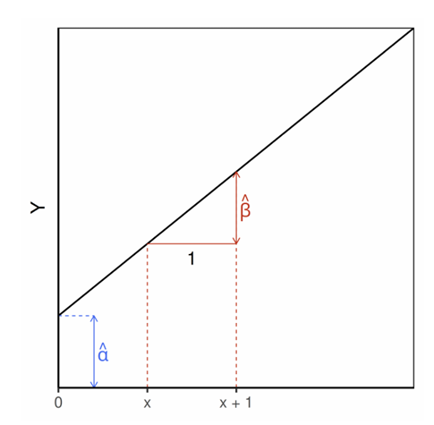
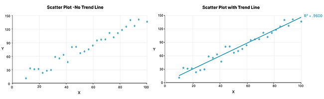
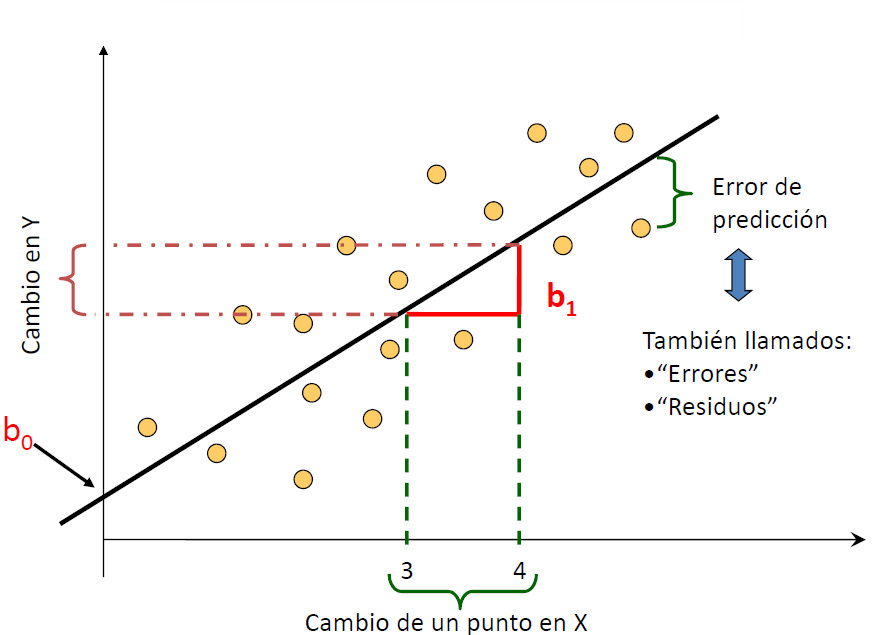

class: inverse, bottom, right

```{r, include=FALSE,echo=FALSE,results='hide'}
#install.packages("pagedown")
#pagedown::chrome_print("cuarta_catedra.html",output="cuarta_catedra.pdf")
```


```{r setup, include=FALSE, cache = FALSE}

library(dplyr)
require("knitr")
options(htmltools.dir.version = FALSE)
pacman::p_load(RefManageR)
knitr::opts_chunk$set(
  echo = FALSE,   # oculta el código
  message = FALSE, 
  warning = FALSE
)
```

```{r eval=FALSE, echo=FALSE}
# Correr esta línea para ejecutar
rmarkdown::render('xaringan::moon_reader')
```

<!---
About macros.js: permite escalar las imágenes como [:scale 50%](path to image), hay si que grabar ese archivo js en el directorio.
.pull-left[<images/Conocimiento cívico.png>] 
.pull-right[<images/Conocimiento cívico_graf.png>]

--->

# _Octava Clase Social Data Science_
## *Regresión lineal simple (RLS)*
<br>
<hr>
### Docentes: Anais Herrera - Francisco Meneses
### Ayudante: Ignacia Silva

---

## De la correlación a la regresión

### ¿Qué ya sabemos?

- La **correlación de Pearson (r)** nos permite:
  - medir la **fuerza** de la relación  
  - identificar la **dirección** (positiva/negativa)  
  - evaluar si la relación es **lineal**

--

### ¿Qué nos falta?

- La correlación **no permite**:
  - predecir valores de \(Y\)  
  - cuantificar el cambio en \(Y\) cuando cambia \(X\)  
  - modelar explícitamente la relación  

---

### La **regresión lineal simple** es una **extensión de la correlación**

- Pasamos de:
  - “¿Qué tan relacionadas están X e Y?”
- A:
  - “¿Cómo cambia Y cuando cambia X?”
  - “¿Podemos predecir Y a partir de X?”

--

### Idea clave

$$
\text{Correlación} \rightarrow \text{Asociación}
$$

$$
\text{Regresión} \rightarrow \text{Asociación + Predicción}
$$

---

## De describir a predecir

Hasta ahora…

- Hemos trabajado con **relaciones entre variables**
- Sabemos identificar si dos variables están asociadas

--

Pero en ciencia de datos queremos ir más allá:

> No solo describir, **sino predecir**

--

### Ejemplo

- Sabemos que **escolaridad** e **ingreso** están correlacionados  
- Pero queremos responder: *¿Cuánto ingreso esperamos para una persona con 12 años de escolaridad?*

--

.center[
👉 Necesitamos un modelo
]

---

## Modelos de Machine Learning Supervisado

### ¿Qué significa “supervisado”?

- Tenemos una variable que queremos predecir → \(Y\)  
- Usamos una o más variables explicativas → \(X\)

???

tenemos una variable objetivo… algo que queremos predecir.

Y usamos otras variables para hacerlo.

--

### Objetivo

👉 Aprender una función que permita predecir:

$$
Y = f(X)
$$
???

En el fondo, estamos tratando de aprender una función que conecte X con Y.”

--

### Ejemplos

- Predecir ingreso a partir de educación  
- Predecir notas a partir de horas de estudio  
- Predecir asistencia a partir de contexto escolar  

---
## Nuestro primer modelo: Regresión lineal simple
## *La función lineal: Un modelamiento parsimonioso*

.pull-left[
Busca explicar la relación entre una variable dependiente $(Y)$ y una independiente $(X)$:

$$
Y = \alpha + \beta X
$$

- $(\alpha)$: intercepto (valor esperado de \(Y\) cuando \(X=0\))  

- $(\beta)$: pendiente o “beta” (cuánto cambia \(Y\) por cada unidad que aumenta \(X\))  


]

.pull-right[



]

???

Definir parsimonia!!
característica deseada en todo modelo científico que plantea que el mejor modelo es aquel capaz de explicar mucho con poco

un modelo parsimonioso es un modelo simple que explica bien

regla metodológica en ciencia que prioriza la explicación más sencilla posible entre varias opciones, si todas explican los datos igualmente bien

¿qué hace RLS?

PPT 

- Ajusta una **línea recta** a los datos  
- Resume la relación entre \(X\) e \(Y\)  
- Permite **predecir valores de \(Y\)**  

---

## Ejemplo intuitivo de relación perfectamente lineal

Supongamos que alguien gana 1.000.000 de pesos y ahorra 200.000 al mes. En enero tenía ahorrados 2.000.000. ¿Cuánto tendrá ahorrado en Octubre (10 meses)? 


.pull-left[
- $Y$ = Ahorro mensual  

- $X$ = Meses de ahorro
]

.pull-right[
- $(\alpha)$: intercepto (2.000.000)

- $(\beta)$: pendiente (200.000)

]


$$
Y = \alpha + \beta X
$$
$$
Y  = \alpha (2.000.000) + \beta(200.000)  * Xmeses (10)
$$
--

> En 10 meses el ahorro será de 4.000.000.

--

> ¿cuánto será en 5, en 8 y en 15 meses? 


---
# Graficando la relación

.pull-left[

```{r echo=FALSE, message=FALSE, warning=FALSE}
options(scipen=999)

# Datos
meses <- 0:10
ahorro <- 2000000 + 200000 * meses

# Gráfico
plot(meses, ahorro,
     type = "b", pch = 19, col = "blue",
     xlab = "Meses",
     ylab = "Ahorro acumulado ($)",
     main = "Ahorro acumulado en el tiempo",
     ylim = c(0, 4500000))   # <- Ajuste del rango en eje Y

# Añadir línea de la recta
abline(lm(ahorro ~ meses), col = "red", lwd = 2)

# Resaltar el punto en octubre (mes 10)
points(10, ahorro[11], col = "darkgreen", pch = 19, cex = 1.5)
text(10, ahorro[11] + 200000, 
     labels = paste0("Octubre: $", format(ahorro[11], big.mark=".")), 
     col = "darkgreen")


```

]

.pull-right[

El gráfico muestra la relación lineal. Mientras pasan los meses aumenta el ahorro.

**Pendiente**: Por cada mes que pasa el ahorro aumenta en $200.000

**Intercepto**: El ahorro parte de una base en los 0 meses, la cual es de $200.000.000

]

---

class: inverse, middle, center, slideInRight

# Mínimos Cuadrados Ordinarios


---

## Ajustando la recta a la complejidad de lo social

Sabemos que la realidad no es *perfectamente lineal*. Aun así, podemos ajustar rectas a la relación entre dos variables para modelarla de manera parsimoniosa.

El método de **mínimos cuadrados ordinarios (OLS)** busca encontrar la recta que **minimiza la suma de los errores al cuadrado**:

$$
\min \sum (Y_i - \hat{Y}_i)^2
$$

> De este modo se genera la predicción lineal más adecuada

.center[

]

---
## Modelo teórico de la Regresión Lineal Simple

.left-column[
$$
Y = \beta_0 + \beta_1 X + \varepsilon
$$

$Y$ var. dependiente

$\beta_0$ intercepto  

$\beta_1$ pendiente 

$X$ var. independiente

$\varepsilon$: error *(parte de \(Y\) que el modelo no logra explicar) * 


]

.right-column[

]

???
aquí vemos la fórmula del modelo teórico de RLS

anteriormente vimos el modelo estimado, ya que en realidad no estimamos el error

Y Hasta ahora hemos visto la recta como si fuera perfecta… pero en la realidad, los datos no siguen exactamente una línea.

Cada punto tiene una diferencia respecto a la recta.

Esa diferencia es lo que llamamos error o residuo.

Y justamente lo que hace la regresión es encontrar la recta que minimiza esos errores.

Pero es importante que mantengamos presente que siempre habrá una parte que el modelo no es capaz de explicar

preguntarles que es el intercepto

que es pendiente

la pendiente es el cambio esperado en \(Y\) por cada unidad que aumenta \(X\)

---

## ¿Cuándo podemos usar regresión?

- Variable dependiente **continua**  

- Variable independiente **continua o categórica**  

- Relación **lineal** entre las variables.  


Ejemplo:  

- $Y$ = ingreso (continuo)  

- $X$ = género (categórica: hombre/mujer) o edad.

La lectura cambia según si es una variable categórica o continua

---

class: inverse, middle, center, slideInRight

# Componentes de una regresión

---

### Interpretación de los parámetros principales

.left-column[

$\beta_1$: Aumento de $Y$ por cada aumento de $X$ 

$\beta_0$: Valor de $Y$ cuando $X$ es 0

$R^2$: prop. de la varianza explicada en el modelo  

$\varepsilon$: parte no explicada por $X$
]

.right-column[
```{r echo=FALSE, results='asis'}
 # library(haven)
 # Casen_2017 <- read_sav("input/Casen 2017.sav")
 # 
 # Casen_2017_mini <- Casen_2017 %>% sample_n(5000) %>% filter(pco1==1) %>% filter(activ==1) %>% select(comuna,
 #                                                        zona,
 #                                                        yaut,
 #                                                        edad,
 #                                                        esc,
 #                                                        sexo,
 #                                                        )
 # 
 # Casen_2017_mini %>% writexl::write_xlsx("input/Casen_2017_mini.xlsx")


library(readxl)
Casen_2017_mini <- read_excel("input/Casen_2017_mini.xlsx")

Casen_2017_mini = Casen_2017_mini %>%  filter(yaut<2200000)

Casen_2017_mini=rename(Casen_2017_mini, ingreso = yaut)

lm(ingreso ~ esc,  data =Casen_2017_mini) %>% stargazer::stargazer(type="html",          omit.stat = c("f", "ser"))
```
]

???

“Por cada unidad adicional de escolaridad, el ingreso aumenta en promedio en aproximadamente 46 mil pesos.”

---


.pull-left[


```{r echo=FALSE, results='asis'}
 # library(haven)
 # Casen_2017 <- read_sav("input/Casen 2017.sav")
 # 
 # Casen_2017_mini <- Casen_2017 %>% sample_n(5000) %>% filter(pco1==1) %>% filter(activ==1) %>% select(comuna,
 #                                                        zona,
 #                                                        yaut,
 #                                                        edad,
 #                                                        esc,
 #                                                        sexo,
 #                                                        )
 # 
 # Casen_2017_mini %>% writexl::write_xlsx("input/Casen_2017_mini.xlsx")


library(readxl)
Casen_2017_mini <- read_excel("input/Casen_2017_mini.xlsx")

Casen_2017_mini = Casen_2017_mini %>%  filter(yaut<2200000)

Casen_2017_mini=rename(Casen_2017_mini, ingreso = yaut)

lm(ingreso ~ esc,  data =Casen_2017_mini) %>% stargazer::stargazer(type="html",          omit.stat = c("f", "ser") # omitir algunas estadísticas para simplificar
)
```
]

.pull-right[


```{r echo=FALSE, message=FALSE, warning=FALSE, results='asis'}

sjPlot::plot_scatter(Casen_2017_mini,esc ,ingreso , fit.line="lm")

```

]

???

“Por cada unidad adicional de escolaridad, el ingreso aumenta en promedio en aproximadamente 46 mil pesos.”

El valor que aparece entre paréntesis corresponde al error estándar. En simple,
“Este número nos dice qué tan precisa es nuestra estimación.” número pequeño → estimación precisa
número grande → estimación más incierta

p value: Significativo significa que es muy poco probable que este resultado se deba al azar. “Tenemos evidencia para creer que esta relación existe en la población.”

El R2 es fundamental. En este caso muestra que “El modelo explica aproximadamente un 21% de la variación en el ingreso.”

Diferencia con ajustado: “El R² ajustado corrige el R² considerando cuántas variables tiene el modelo.”

“El R² siempre sube cuando agregas variables…
el ajustado penaliza agregar variables innecesarias.”

SINTESIS:
Este modelo nos muestra que la escolaridad tiene un efecto positivo sobre el ingreso.

Por cada año adicional de estudio, el ingreso aumenta en promedio en 46 mil pesos.

Este resultado es estadísticamente significativo, lo que significa que es poco probable que se deba al azar.

El modelo explica aproximadamente un 21% de la variación en el ingreso, lo cual es razonable en ciencias sociales.

---

## Idea del intercepto

- Representa el valor esperado de $Y$ cuando $X$=0.  

- En algunos casos tiene sentido (ej: ingreso con 0 años de estudio).  

- En otros, es solo un punto de referencia matemático.  


---

## Una variable dependiente, muchas independientes

Podemos analizar una variable de interés (ej: **Ingreso**) usando varias **regresiones lineales simples** por separado:

- Ingreso ~ Edad  
- Ingreso ~ Escolaridad  
- Ingreso ~ Género  


Con esto podemos **comparar** cuál variable explica mejor el ingreso, aunque todavía no estamos considerando que pueden estar relacionadas entre sí.  


---


.small[

```{r echo=FALSE, message=FALSE, warning=FALSE, results='asis'}
m1 <- lm(ingreso ~ edad, data = Casen_2017_mini)
m2 <- lm(ingreso ~ esc, data = Casen_2017_mini)
m3 <- lm(ingreso ~ sexo, data = Casen_2017_mini)
m4 <- lm(ingreso ~ zona, data = Casen_2017_mini)

# Tabla comparativa con stargazer
stargazer::stargazer(m1, m2, m3, m4,
          type = "html",
          #title = "Regresiones lineales simples: Ingreso autónomo (yaut)",
          dep.var.labels = "Ingreso autónomo",
          covariate.labels = c("Edad", "Escolaridad", "Sexo", "Zona", "Intercepto"),
          omit.stat = c("f", "ser"), # omitir algunas estadísticas para simplificar
          no.space = TRUE)

```
]


---

### En síntesis como leer una regresión...

$\beta_0$:  Intercepto, nos dice el valor de la dependiente cuando la independiente es 0

$\beta_1$:  Es la pendiente 

***¿Cómo se lee el resultado del beta de regresión?***
- Variable X numérica: indica cuánto cambia, en promedio, la variable dependiente por cada unidad que aumenta la variable independiente.

- Variables X categóricas: indica cuánto difiere, en promedio, la variable dependiente entre el grupo 1 y la categoría de referencia (grupo 0).

**p**: indica la significación (Resultado extrapolable a población).

---

### En síntesis como leer una regresión...

**R2**: proporción de la variación de Y que el modelo logra explicar. 

*Párametros para interpretar la capacidad explicativa del modelo:*

- Valores cercanos a 0 → el modelo explica poco  
- Valores más altos → el modelo explica mejor  

⚠️ No hay umbrales fijos: depende del contexto 

Interpretación orientativa (ciencias sociales):

- Bajo: < 0.10  
- Medio: 0.10 – 0.30  
- Alto: > 0.30  
--- 
Para predecir: sustituir valores en la fórmula del modelo  


$$
Y = \alpha + \beta X
$$

---

## Utilidad de la regresión: dos grandes usos

1. **Comprender relaciones** entre variables  
   - Ejemplo: ¿cuánto influye la escolaridad en los ingresos?  

2. **Predecir valores**  
   - Ejemplo: estimar ingresos de una persona dada su edad y nivel educativo  

---

class: inverse, middle, center, slideInRight

# Leamos resultados


---


```{r echo=FALSE, message=FALSE, warning=FALSE, results='asis'}
library(readxl)
muestra_aleatoria_ptu <- read_excel("input/muestra_aleatoria_ptu.xlsx")


modelo1 = lm(PROMEDIO_NOTAS ~  1 , data = muestra_aleatoria_ptu)

modelo2 = lm(PROMEDIO_NOTAS ~ COD_SEXO, data = muestra_aleatoria_ptu)

modelo3 = lm(PROMEDIO_NOTAS ~ DEPENDENCIA, data = muestra_aleatoria_ptu)

modelo4 = lm(PROMEDIO_NOTAS ~ DEPENDENCIA + COD_SEXO, data = muestra_aleatoria_ptu) 


stargazer::stargazer(list(modelo1,modelo3 , modelo2,modelo4), type="html",
          omit.stat = c("f", "ser"))
```


---

.small[

```{r echo=FALSE, message=FALSE, warning=FALSE, results='asis'}

library(readr)

# Leer datos desde Zenodo
url <- "https://zenodo.org/record/5541146/files/20210930-ARD-MLtutorial.csv"
calzado <- read_csv(url)

modelo1 <- lm(shoesize_europe ~ is_female , data = calzado)
modelo2 <- lm(shoesize_europe ~ weight_kg , data = calzado)
modelo3 <- lm(shoesize_europe ~ height_cm, data = calzado)
stargazer::stargazer(list(modelo1,modelo2,modelo3), type = "html", title="Modelo: predecir talla de calzado 👟",
          omit.stat = c("f", "ser"))

```

]

---

## Actividad 1

Dado el modelo:

$$
Ingreso = 300 + 200 \cdot \text{Escolaridad}
$$

- ¿Cuál es el ingreso esperado para una persona con 10 años de escolaridad?  
- ¿Y para una persona con 15 años?  


---

## Actividad 2 (Discusión)

- ¿Qué riesgos existen al usar la regresión solo como herramienta de predicción sin pensar en causalidad?  

---

## Ticket de salida
.center[


]